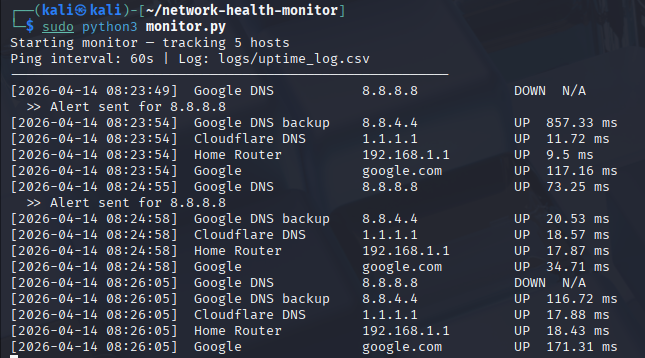
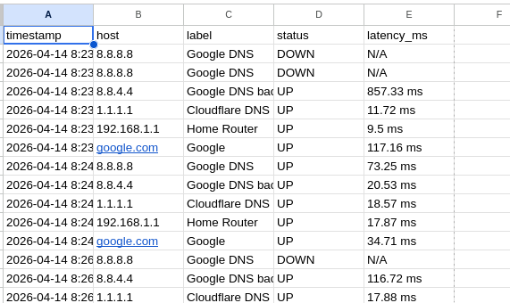

# Network Health Monitor

A Python tool that monitors network host availability,
logs uptime metrics, and sends email alerts on outages.

## 🚀 Project Overview
This project monitors network hosts using ICMP ping, logs uptime data, and sends email alerts during outages.

## Features
- Multi-host ping monitoring with configurable interval
- CSV uptime logging with timestamps
- Email alerts with cooldown (anti-spam)
- Status change detection (UP/DOWN/RECOVERED)
- Cross-platform (Linux, Windows, macOS)

## How to run
```
git clone <your-repo>
cd network-health-monitor
python monitor.py
```

## 🔐 Configuration

Update `config.py` with your email credentials before running the project.

⚠️ Note: Do NOT upload real credentials to GitHub. Use environment variables for production use.

## 📸 Output Screenshots

### Ping Monitoring Output


### CSV Log Output


### Alert Trigger Output


